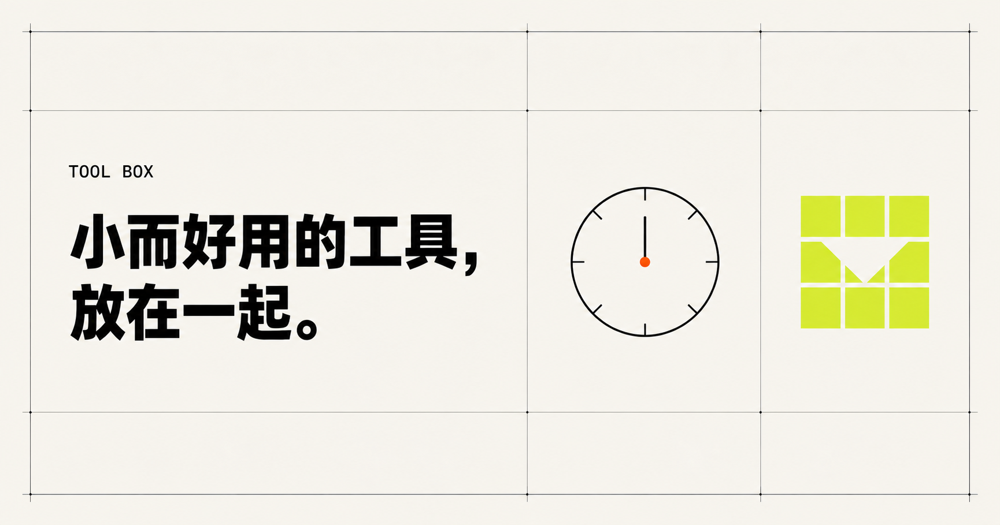

# Tool Box

一个开箱即用的浏览器工具集合：在独立页面中完成时间、网络地址和数据格式转换，也可以探索交互模拟与视觉作品。无需注册或后端服务，打开页面即可使用。



**技术栈：** Vite · React · TypeScript

**快速导航：** [工具一览](#工具一览) · [快速开始](#快速开始) · [开发与部署](#开发与部署) · [项目结构](#项目结构) · [参与贡献](#参与贡献)

## 特性

- 七个工具和互动页面各有独立访问路径，首页卡片会在新标签页打开对应页面。
- 时间、IP、UUID 和 JSON 等数据处理在浏览器本地完成。
- 构建产物是静态多页面站点，可部署到 EdgeOne 或 Cloudflare Pages。

## 工具一览

| 工具 | 访问路径 | 说明 |
| --- | --- | --- |
| Unix 时间戳 | `/unix/` | 在日期时间与 Unix 时间戳之间转换 |
| VM 装箱模拟 | `/box/` | 交互查看 VM 装箱过程 |
| IP 网段转换 | `/cidr/` | 转换 CIDR 网段、IP 范围与地址列表 |
| 鹈鹕骑车测试 | `/bike/` | 浏览鹈鹕骑车互动页面 |
| 色彩流动 | `/flow/` | 体验动态色彩效果 |
| UUID 生成 | `/uuid/` | 生成并解读 UUID |
| JSON 格式化 | `/json/` | 格式化、编辑和校验 JSON |

## 快速开始

使用 Node.js 24（见 [`.nvmrc`](.nvmrc)）和 npm：

```sh
git clone https://github.com/OVINC-CN/ToolBox.git
cd ToolBox
npm ci
npm run dev
```

打开终端显示的本地地址进入首页，再通过卡片打开各工具。也可以直接访问上表列出的路径。

## 开发与部署

| 命令 | 用途 |
| --- | --- |
| `npm run dev` | 启动本地开发服务器 |
| `npm run lint` | 检查项目源码 |
| `npm run typecheck` | 检查 TypeScript 类型 |
| `npm run build` | 运行 ESLint 和类型检查，生成静态站点 |
| `npm run preview` | 在本地预览构建产物，需先运行 `npm run build` |

部署到静态托管平台时，使用 `npm run build` 作为构建命令，将 `dist/` 设为发布目录。构建过程会整理各工具的公开路径，并为没有文件名哈希的静态资源引用附加本次构建的 `?v=` 时间戳。

## 项目结构

```text
pages/                    首页和各工具的 HTML 入口
src/catalog.ts            首页工具清单与构建入口来源
src/tools/                工具界面和业务逻辑
src/shared/               共享的 React 挂载代码
public/                   直接复制到产物的静态资源（含鹈鹕页面）
scripts/publish-pages.mjs 整理构建后的页面路径
scripts/version-static-assets.mjs 为静态资源引用添加构建版本
```

## 参与贡献

欢迎通过 [Issues](https://github.com/OVINC-CN/ToolBox/issues) 反馈问题，或提交 Pull Request。新增常规工具时：

1. 在 `src/tools/` 添加工具实现，在 `pages/` 添加对应的 HTML 入口。
2. 在 `src/catalog.ts` 登记工具信息；Vite 构建入口由该清单生成。
3. 提交前运行 `npm run build`，确认代码检查、类型检查和构建通过。

## 许可证

本项目采用 [MIT License](LICENSE)。
